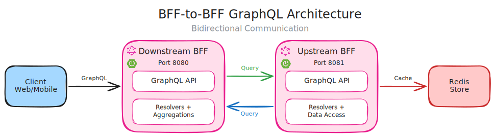
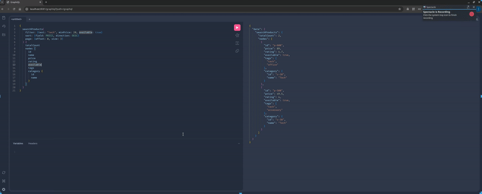
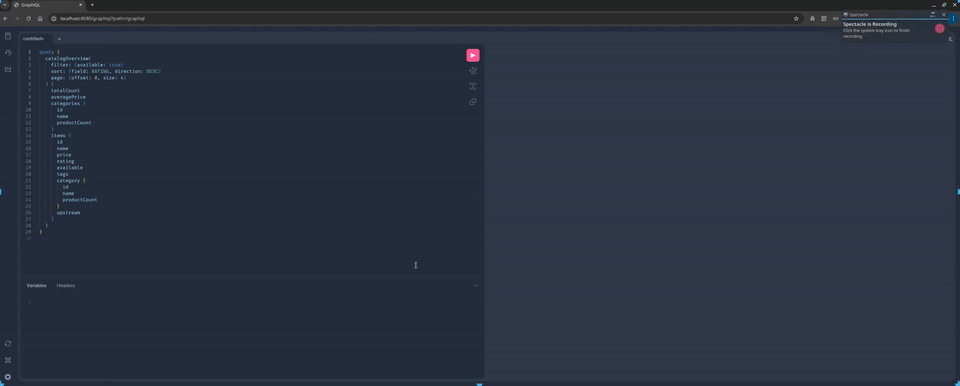

# GraphQL BFF-to-BFF

A small experimental setup where a BFF calls an upstream BFF over GraphQL, with Redis backing the upstream service.

## Architecture



## Rationale

- Keep each BFF focused on its domain.
- Show how one BFF can communicate with another via GraphQL.

## Walkthroughs

**Upstream BFF (GraphiQL)**



**Downstream BFF (GraphiQL)**



## Run with Docker Compose

```bash
docker compose up --build
```

Redis is included in the compose stack for upstream storage.

## Queries

### Basic flow

Upstream GraphiQL: http://localhost:8081/graphiql

```graphql
query {
  products { id name price }
}
```

Downstream GraphiQL: http://localhost:8080/graphiql

```graphql
query {
  productSummary(id: "p-100") { id name price upstream }
}
```

### Aggregations and filtering

Upstream query:

```graphql
query {
  searchProducts(
    filter: { text: "tech", minPrice: 20, available: true }
    sort: { field: PRICE, direction: DESC }
    page: { offset: 0, size: 3 }
  ) {
    totalCount
    nodes {
      id
      name
      price
      rating
      available
      tags
      category { id name }
    }
  }
}
```

Downstream query:

```graphql
query {
  catalogOverview(
    filter: { available: true }
    sort: { field: RATING, direction: DESC }
    page: { offset: 0, size: 4 }
  ) {
    totalCount
    averagePrice
    categories { id name productCount }
    items {
      id
      name
      price
      rating
      available
      tags
      category { id name productCount }
      upstream
    }
  }
}
```

## Notes

- Downstream BFF composes data from upstream via GraphQL.
- Upstream owns domain data and schema.
